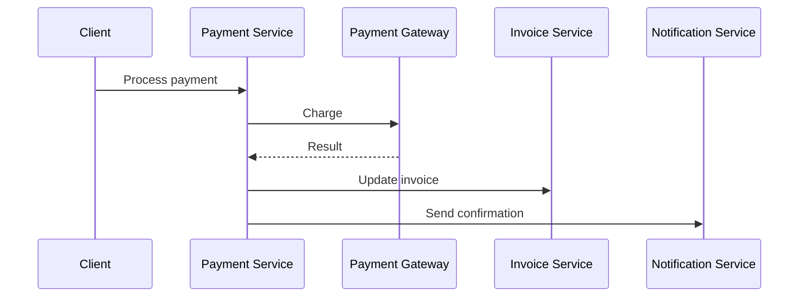

# Payment Service Implementation

## Context

Implementación del servicio de pagos para Zerovariance.

## Architecture

Servicios involucrados:
- Payment Service
- Invoice Service
- Notification Service

## Implementation

### Flow

## Risks

- Manejo de errores de payment gateway
- Idempotencia de transacciones

## Future Improvements

- Implementar retry logic
- Agregar webhooks para actualizaciones

## Related

- [[event-driven-architecture]]
