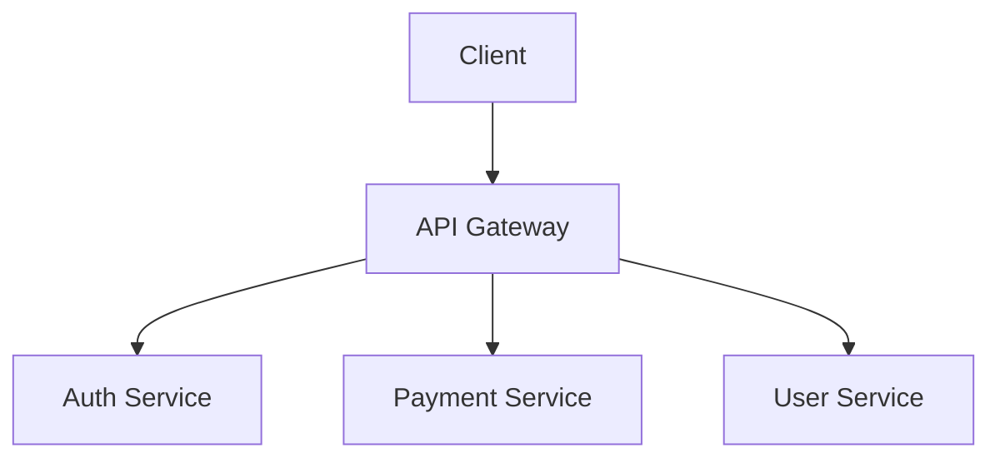

# System Overview - GLIM

## Overview

Descripción general del sistema GLIM.

## Architecture Diagram

## Components

### API Gateway
Punto de entrada principal.

### Auth Service
Servicio de autenticación.

### Payment Service
Servicio de pagos.

### User Service
Servicio de usuarios.

## Technology Stack

- Backend: [tecnología]
- Database: [base de datos]
- Message Queue: [cola de mensajes]

## Related

- [[microservices]]
- [[login-flow]]
