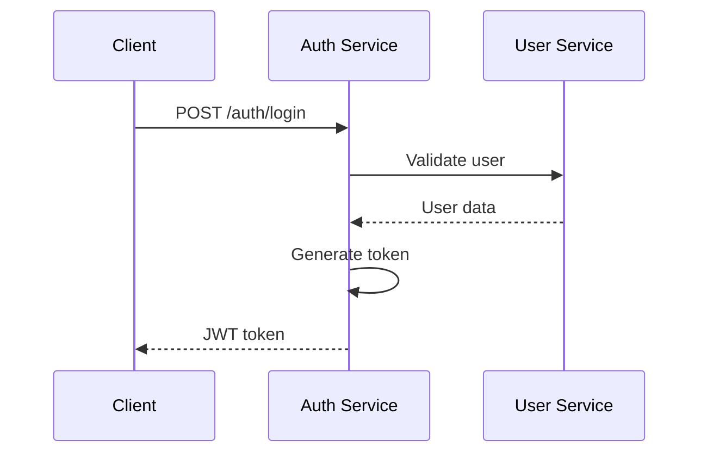

# Login Flow Implementation

## Context

Implementación del flujo de autenticación en GLIM.

## Architecture

Servicios involucrados:
- Auth Service
- User Service

## Implementation

### Flow

### Code Changes

- Endpoint: `/auth/login`
- Validation: [detalles]
- Token generation: JWT

## Risks

- Token expiration handling
- Rate limiting necesario

## Future Improvements

- Implementar refresh tokens
- Agregar 2FA

## Related

- [[adr-001-auth-strategy]]
- [[user-endpoints]]
- [[event-driven-architecture]]
